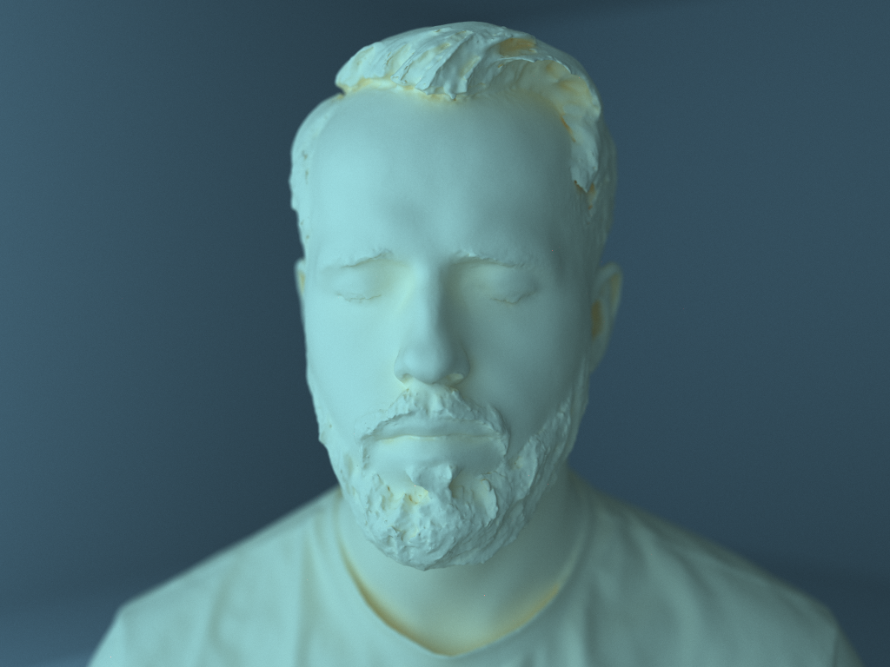
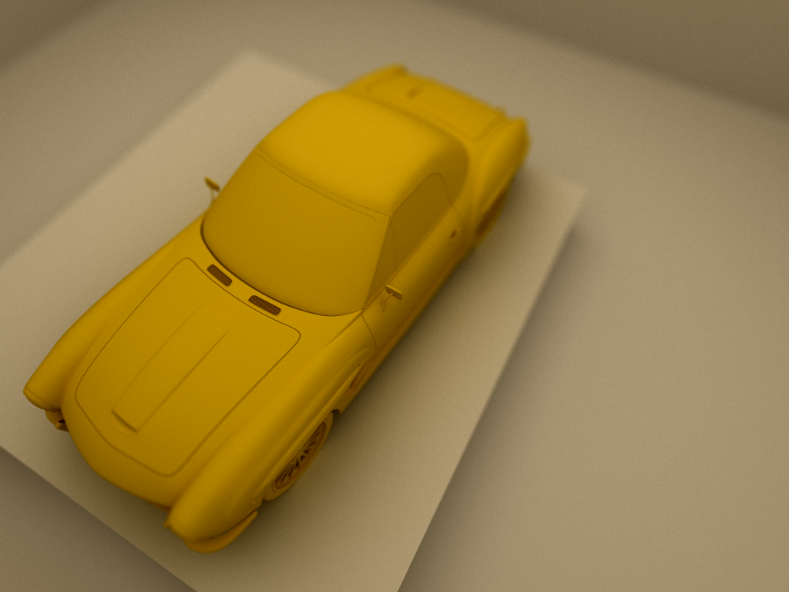
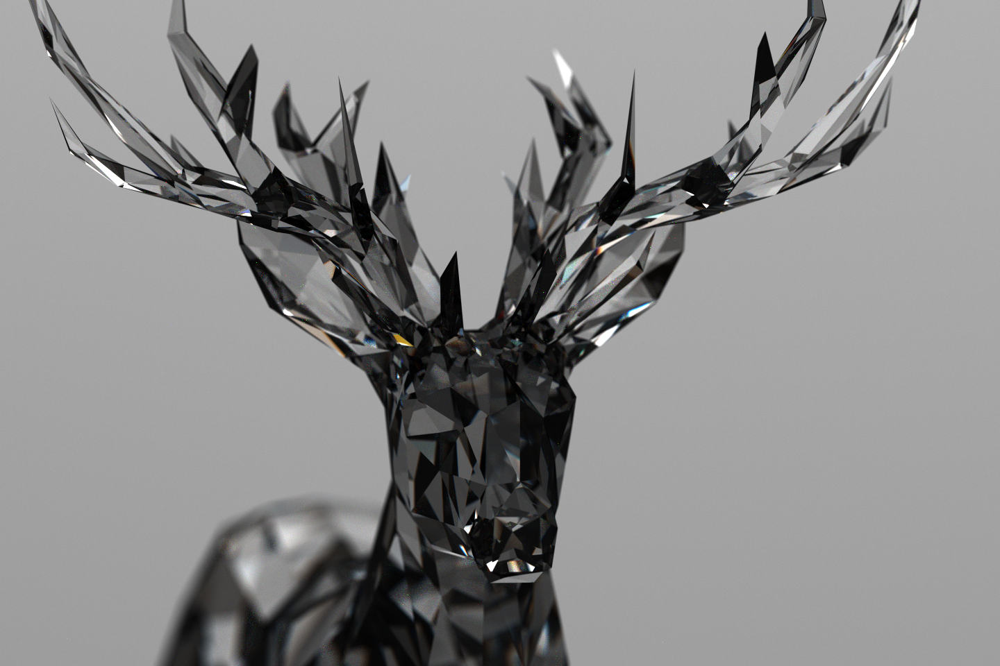

# Cuda toy path tracer
A simple progressive path tracer built with CUDA using a BVH as an acceleration structure.

- simple lens simulation
- light are modeled as black body
- rendering is done at interactive framerate

# Samples

